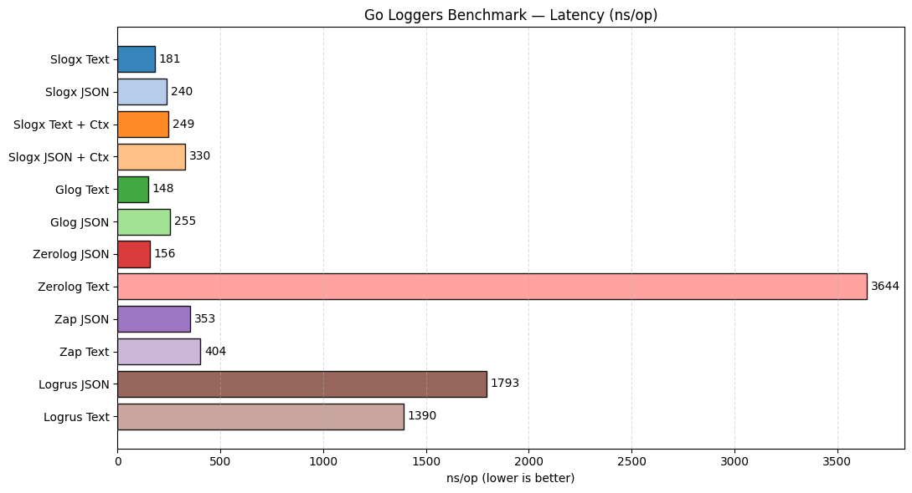
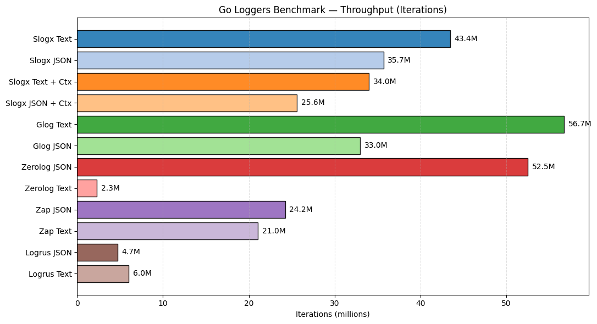

# slogx

[](https://pkg.go.dev/github.com/jeffotoni/slogx) [](https://goreportcard.com/report/github.com/jeffotoni/slogx) [](https://github.com/jeffotoni/slogx/blob/main/LICENSE)  


Fluent structured logging for Go, built on top of `log/slog`.

`slogx` does **not** replace `log/slog`. It is a fluent layer that builds `slog` attributes and delegates the actual log writing to `log/slog` handlers.

## 🎯 Who it's for

`slogx` is designed for developers and teams that already use `log/slog`, rely heavily on `context.Context` to carry request-scoped data (trace IDs, user/session identifiers, etc.), and want structured logging with a fluent API and low overhead.

## 🧾 Formats

- `json`: machine-friendly (default)
- `text`: `time | level | trace | msg | k=v...` (human-friendly)
- `slog`: `log/slog` text handler (`key=value`)

## ✅ Defaults
- `time` and `level` are always present
- output is structured (even in `text`)
- level filtering is enforced by the handler
- `Entry.Send()` returns `error` (write/handler errors)

---

## Install

```bash
go get github.com/jeffotoni/slogx
```

---

## Quick Start (3 formats)

```go
package main

import (
	"context"
	"os"

	"github.com/jeffotoni/slogx"
)

func main() {
	ctx := slogx.WithCtx(context.Background()).
		TraceID("abc123").
		Str("X-User-ID", "user42").
		Any("attempt", 3).
		Context()

	slogx.New(slogx.Config{Format: slogx.FormatJSON, Writer: os.Stdout, ServiceName: "api"}).
		Info().
		Ctx(ctx).
		Str("component", "auth").
		Msg("user login").
		Send()

	slogx.New(slogx.Config{Format: slogx.FormatText, Writer: os.Stdout, ServiceName: "api"}).
		Info().
		Ctx(ctx).
		Str("component", "auth").
		Msg("user login").
		Send()

	slogx.New(slogx.Config{Format: slogx.FormatSlog, Writer: os.Stdout, ServiceName: "api"}).
		Info().
		Ctx(ctx).
		Str("component", "auth").
		Msg("user login").
		Send()
}
```

Note: field ordering is **not** guaranteed, especially for fields imported from `context.Context`.

🖨️ Sample Output (text)

🟣 TRACE  
🔵 DEBUG  
🟢 INFO  
🟡 WARN  
🔴 ERROR

Sample output:

```text
// json
{"time":"2026-01-27T16:04:16-03:00","level":"INFO","msg":"user login","service":"api","attempt":3,"traceId":"abc123","X-User-ID":"user42","component":"auth"}

// text
2026-01-27T16:04:16-03:00 | INFO | abc123 | user login | service=api | X-User-ID=user42 | attempt=3 | component=auth

// slog
time=2026-01-27T16:04:16-03:00 level=INFO msg="user login" service=api X-User-ID=user42 attempt=3 traceId=abc123 component=auth
```

Tip: run the repo demo:

```bash
go run ./examples/demo
```

---

## 🧩 Minimal example (no context)

```go
package main

import "github.com/jeffotoni/slogx"

func main() {
	err := slogx.New().
		Info().
		Str("component", "bootstrap").
		Int("attempt", 1).
		Msg("service started").
		Send()
	if err != nil {
		panic(err)
	}
}
```

---

## ⚠️ Error handling (`Send() error`)

`Send()` returns `nil` on success and when the level is filtered out.
Handle the return when you need delivery guarantees to the configured writer.

```go
if err := log.Info().
	Str("component", "api").
	Msg("ready").
	Send(); err != nil {
	// writer/handler failure
}
```

---

## Context (string fields)

Use `NewCtx()` to create a `context.Context` with string-only fields.

```go
ctx, cancel := slogx.NewCtx().
	Set("X-Trace-ID", "abc-123").
	Set("X-User-ID", "user-42").
	Set("X-Session-ID", "sess-999").
	Timeout(10 * time.Second).
	Build()
defer cancel()

traceID := slogx.CtxGet(ctx, "X-Trace-ID") // "abc-123"
userID := slogx.CtxGet(ctx, "X-User-ID")  // "user-42"
fields := slogx.CtxGetAll(ctx)            // map[string]string{...}
```

Notes:
- `NewCtx(parentCtx)` preserves cancel/deadline from the parent context.
- `CtxGetAll` returns only the string fields stored by `NewCtx().Set(...)`.

---

## Context (typed fields / any)

Use `WithCtx(ctx)` to attach typed values (int/bool/map/etc) to an existing context.

```go
ctx := slogx.WithCtx(context.Background()).
	Any("attempt", 3).
	Bool("cached", true).
	Str("role", "admin").
	Context()

v, _ := slogx.CtxGetAny(ctx, "attempt") // 3
all := slogx.CtxGetAllAny(ctx)          // map[string]any{...}
```

Typed fields are cumulative across calls:

```go
ctx1 := slogx.WithCtx(context.Background()).
	Any("a", 1).
	Context()

ctx2 := slogx.WithCtx(ctx1).
	Any("b", 2).
	Context()

all := slogx.CtxGetAllAny(ctx2) // map[string]any{"a":1,"b":2}
```

---

## Logging with context (`Entry.Ctx(ctx)`)

`Entry.Ctx(ctx)` does two things:
1) uses the provided `context.Context` in the underlying `slog` call
2) **imports** fields from context into the log entry (`string` + `typed`)

```go
ctx := slogx.WithCtx(context.Background()).
	TraceID("abc123").
	Str("X-User-ID", "user42").
	Any("attempt", 3).
	Context()

log := slogx.New(slogx.Config{Format: slogx.FormatJSON, ServiceName: "api"})
log.Info().
	Ctx(ctx).
	Msg("request").
	Send()
```

---

## 🔁 Field precedence (conflict resolution)

When a key exists in more than one source, conflicts follow a **last-write-wins** rule (consistent with `log/slog`).

In typical usage, precedence is:

1) Fields set directly on the `Entry` (`Entry.Str/Any/Int/...`) **after** `Entry.Ctx(ctx)` override context-imported fields.
2) Typed context fields (from `WithCtx`) override string context fields (from `NewCtx`) when keys collide.
3) String context fields (from `NewCtx`) have the lowest precedence.

Tip: set request-wide defaults in the context, call `Entry.Ctx(ctx)` to import them, then override per-log fields directly on the `Entry` when needed.

---

## 🧼 Empty keys and empty string values

`slogx` treats empty keys (`""`) and empty string values differently depending on the API:

- **Empty keys (`""`)** are ignored across the board: setters on `Entry`, `NewCtx().Set`, and `WithCtx(...).Any/Str` become no-ops.
- **Empty string values**:
  - `NewCtx().Set(key, "")` is ignored (not stored in the context).
  - `WithCtx(...).Str(key, "")` is ignored (not stored in the context).
  - `Entry.Str(key, "")` is allowed and logs an empty string value.
- **Errors**:
  - `Entry.Err(err)` logs under the default key `"error"`.
  - `Entry.Err("customKey", err)` logs under a custom key.

---

## ⚡ Performance notes

- No context processing happens unless you call `Entry.Ctx(ctx)`.
- Context fields are imported into the log entry only when explicitly requested via `Entry.Ctx(ctx)`.
- `WithCtx(ctx)` avoids copying typed fields unless you actually add/modify fields and call `Context()`.
- If `WithCtx(ctx)` does not add fields, `Context()` returns the original `ctx` (no extra `context.WithValue`).
- If the provided `ctx` has no `slogx` fields, `Entry.Ctx(ctx)` short-circuits without extra merge allocations.

---

## 🧪 Test coverage

Run:

```bash
go test -v -cover
```

Current coverage: ~52% (`52.2%` of statements at the time of writing).

Unit tests currently cover:
- Default config behavior + time format override
- Level filtering + TRACE level rendering
- JSON output rules: `Entry.JSON`, `Any([]byte)` auto-detect, invalid JSON fallback, map encoding
- Text output rules: `time | level | trace | msg` header + no trace duplication in fields
- Context helpers: `NewCtx` / `WithCtx` (deadlines + cumulative fields)
- Entry helpers: `Action`, `Time`, `Number`, `Err`

---

## 📊 Benchmarks (reference)

These benchmarks are meant for **regression tracking** and transparency, not as a claim of “better than X”.
Different libraries have different defaults and semantics, so always benchmark with your own workload/config.

Run:

```bash
cd .poc/bench
go test -bench=. -run=^$ -benchtime=7s -benchmem
```

Example output (Apple M3 Max, darwin/arm64):

```text
goos: darwin
goarch: arm64
pkg: slogx-bench
cpu: Apple M3 Max
BenchmarkSlogx_Text-16            	43445082	       181.0 ns/op	       0 B/op	       0 allocs/op
BenchmarkSlogx_JSON-16            	35682792	       240.0 ns/op	       0 B/op	       0 allocs/op
BenchmarkSlogx_Text_WithCtx-16    	34005211	       249.3 ns/op	       0 B/op	       0 allocs/op
BenchmarkSlogx_JSON_WithCtx-16    	25595169	       329.8 ns/op	       0 B/op	       0 allocs/op
BenchmarkGlog_Text-16             	56735336	       148.2 ns/op	       0 B/op	       0 allocs/op
BenchmarkGlog_JSON-16             	32962898	       254.7 ns/op	      32 B/op	       1 allocs/op
BenchmarkZerolog_JSON-16          	52502023	       156.2 ns/op	       0 B/op	       0 allocs/op
BenchmarkZerolog_Text-16          	 2310800	      3644 ns/op	    2438 B/op	      82 allocs/op
BenchmarkZap_JSON-16              	24222016	       353.1 ns/op	     352 B/op	       2 allocs/op
BenchmarkZap_Text-16              	21044398	       403.5 ns/op	     385 B/op	       4 allocs/op
BenchmarkLogrus_JSON-16           	 4701202	      1793 ns/op	    2286 B/op	      35 allocs/op
BenchmarkLogrus_Text-16           	 6027985	      1390 ns/op	    1298 B/op	      20 allocs/op
PASS
ok
```

Compared libraries:
- `quick/glog` (glog): https://github.com/jeffotoni/quick/tree/main/glog
- `zerolog`: https://github.com/rs/zerolog
- `zap`: https://github.com/uber-go/zap
- `logrus`: https://github.com/sirupsen/logrus

### 📈 Charts

📊 Chart 1 — Latency (ns/op)

Reading: lower is better.



Highlights:
- 🥇 Glog Text (~148 ns/op)
- 🥈 Zerolog JSON (~156 ns/op)
- 🥉 Slogx Text (~181 ns/op)
- The cost of `WithCtx` in `slogx` shows up clearly, but remains competitive.
- Zerolog Text and Logrus stand out dramatically in this chart (good for storytelling 😈).

🚀 Chart 2 — Throughput (iterations)

Reading: higher is better.



Here we use the raw benchmark iteration counts, for example:
- `43445082` → `43.4M` iterations

Highlights:
- Glog Text (~56.7M) and Zerolog JSON (~52.5M) lead.
- Slogx Text (~43.4M) is strong and consistent.
- Zerolog Text drops to ~2.3M → huge visual contrast.
- Logrus confirms low throughput.

---

## 📝 Text format (`FormatText`) rules

`FormatText` emits one line per record using a fixed header and a `k=v` tail:

- **Header**: `time | level | trace | msg` (the separator is configurable via `Config.Separator`)
- **Trace extraction**: the `trace` header is extracted by scanning attributes for any of these keys: `Config.TraceIDKey`, `traceId`, `trace_id` (first match wins).
- **No duplication**: the trace key is not repeated in the tail `k=v...`, keeping the header stable and avoiding redundancy.
- **Tail fields**: all other fields are rendered as `key=value`; structured values (maps/slices/structs) are rendered as JSON when possible.

---

## Trace ID

By default, the trace key is `traceId`. You can change it per logger/config:

```go
log := slogx.New(slogx.Config{TraceIDKey: "X-Trace-ID"})
log.Info().
	TraceID("abc123").
	Msg("x").
	Send() // writes field "X-Trace-ID":"abc123"
```

For contexts, you can also change the key on the builders:

```go
ctx, cancel := slogx.NewCtx().
	TraceKey("X-Trace-ID").
	TraceID("abc123").
	Build()
defer cancel()

ctx = slogx.WithCtx(ctx).
	TraceKey("X-Trace-ID").
	TraceID("abc123").
	Context()
```

In `FormatText`, the header field `trace` is extracted from the configured `TraceIDKey`
(also accepts `traceId`, `trace_id`). The trace field is not duplicated as `k=v` in the tail.

---

## JSON fields (`Entry.JSON` and `Any([]byte)` auto-detect)

### Explicit JSON raw field

```go
log.Info().
	JSON("payload", []byte(`{"a":1}`)).
	Msg("x").
	Send()
```

### `Any([]byte)` auto-detect

```go
log.Info().
	Any("payload", []byte(`{"a":1}`)).
	Msg("x").
	Send()
```

Rules:
- if `json.Valid(trimmedBytes)` => embeds as JSON object/array
- else if UTF-8 => stores as string
- else => stores as base64 string

This guarantees the final log output is always valid JSON (in `FormatJSON`).

---

## Config

```go
type Config struct {
	Format     slogx.Format // json|text|slog
	Writer     io.Writer    // default: os.Stdout
	TimeFormat string       // default: RFC3339
	Level      slogx.Level  // default: INFO
	Separator  string       // default: " | " (text) or " " (others)

	ServiceName string // adds "service" to every entry
	TraceIDKey  string // default: "traceId"
}
```

---

### Examples

```go
// JSON to stdout (default format is json if omitted).
log := slogx.New(slogx.Config{Format: slogx.FormatJSON})
log.Info().
	Str("component", "api").
	Msg("ready").
	Send()
```

```go
// Human-friendly text format with a custom separator.
log := slogx.New(slogx.Config{
	Format:    slogx.FormatText,
	Separator: " | ",
})
log.Info().
	TraceID("abc123").
	Msg("request").
	Send()
```

```go
// Configure trace key + service name.
log := slogx.New(slogx.Config{
	ServiceName: "api",
	TraceIDKey:  "X-Trace-ID",
})
log.Info().
	TraceID("abc123").
	Msg("x").
	Send() // writes "X-Trace-ID":"abc123"
```

---

### More examples

```go
// Default error key ("error").
log.Error().
	Err(errors.New("boom")).
	Msg("request failed").
	Send()
```

```go
// Convenience numeric logging (without choosing Int/Float methods).
log.Info().
	Number("status", 200).
	Number("bytes", int64(1234)).
	Number("latency_ms", 12.3).
	Msg("request").
	Send()
```

```go
// Context defaults + per-entry overrides (last-write-wins).
ctx := slogx.WithCtx(context.Background()).
	Str("role", "user").
	Any("attempt", 1).
	Context()

log.Info().
	Ctx(ctx).
	Str("role", "admin").
	Msg("request").
	Send()
```

## 🧪 Complete example (mixing context + many field types)

```go
package main

import (
	"context"
	"errors"
	"os"
	"time"

	"github.com/jeffotoni/slogx"
)

func main() {
	log := slogx.New(slogx.Config{
		Format:      slogx.FormatText,
		Writer:      os.Stdout,
		TimeFormat:  slogx.LayoutISO8601Nano,
		Level:       slogx.DEBUG,
		Separator:   " | ",
		ServiceName: "api",
		TraceIDKey:  "X-Trace-ID",
	})

	ctx, cancel := slogx.NewCtx(context.Background()).
		TraceKey("X-Trace-ID").
		TraceID("abc123").
		Set("X-User-ID", "user42").
		Timeout(10 * time.Second).
		Build()
	defer cancel()

	ctx = slogx.WithCtx(ctx).
		Any("attempt", 3).
		Bool("cached", true).
		Any("meta", map[string]any{"a": 1, "b": "x"}).
		Context()

	log.Info().
		Ctx(ctx).
		Caller().
		Component("auth").
		Action("login").
		Bool("success", true).
		Int("status", 200).
		Int64("bytes", 1234).
		Float64("latency_ms", 12.3).
		Duration("elapsed", 120*time.Millisecond).
		Time("now", time.Now()).
		Any("labels", map[string]string{"env": "dev"}).
		JSON("payload", []byte(`{"ok":true}`)).
		Err(errors.New("boom")).
		Msg("request").
		Send()
}
```

---

## 🧭 API stability

The public API is intended to be stable, but it may still evolve with small breaking changes until `v1.0.0`.

---

## 💬 Contribute

If you like this project, give it a ⭐ star and feel free to open issues or PRs.

---

## Notes

- `FormatJSON` and `FormatText` are implemented by `slogx` handlers (they implement `log/slog.Handler`).
- `FormatSlog` delegates to the standard library `log/slog` text handler.
- Field ordering is not guaranteed (especially for fields imported from context maps).
